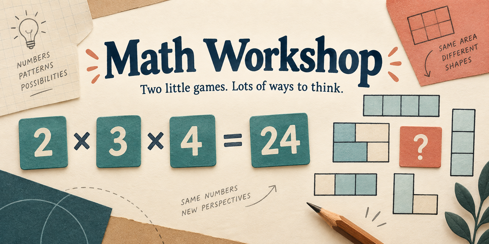

# Math Workshop

**Two complete math games for trying things, seeing your work, and finding another way.** No account, subscription, AI service, or installation is needed to play.

- **[Play in your browser](https://jessemaddox.com/projects/math-workshop/play/)**
- **[Download Target Number](https://github.com/jessecmaddox3/math-workshop/releases/download/v1.0.0/Target-Number.html)**
- **[Download Area Mazes](https://github.com/jessecmaddox3/math-workshop/releases/download/v1.0.0/Area-Mazes.html)**

I built these for me and my personal use, then cleaned them up so other people could use the whole thing. Make them your own, and feel free to improve mine. Hopefully they give you a useful starting point, or at the very least some ideas. Cheers!

## Start here, even if you do not use GitHub

The first link opens a menu. Choose a game and start playing. The app creates a local learner called **Player 1**. Open **Learners and backups** to add your own nickname. Each game has its own learners and progress.

To keep a copy that works without internet:

1. Click one of the **Download** links above. Your browser saves an HTML file, usually in Downloads. You do not need the green Code button or a GitHub account.
2. Find the downloaded file and double-click it. It opens in your usual web browser. If your browser displays the file rather than saving it, use its Download or Save link option first.
3. Play. Keep using the same file and browser, and use **Export this learner’s progress** before moving the file, changing browsers, or clearing browser data.

The two files contain the complete games, styles and license notices. They do not fetch fonts, analytics, ads or an AI model. If your browser cannot save locally, the game clearly says **Temporary session**. You can still play, add learners and export progress, but closing that page loses temporary progress.

## What you get

### Target Number

Combine two chips with addition, subtraction, multiplication or division until every starting number has been used once and one chip remains. Hit the target exactly.

- Every generated card is solvable. Three levels widen the number pool and targets.
- Exact fractions keep answers such as `8 ÷ (3 − 8 ÷ 3) = 24` correct.
- Fused chips keep their component expressions, and every step stays in the written working.
- Undo, start over, try another card, wait for a structural hint, or find another route to the same answer.
- Cards advance after a short celebration by default. Turn off automatic advance to keep thinking or read at your own pace.
- Both wrong and correct completed attempts are saved. Replaying the identical successful route cannot add another credit.

### Area Mazes

Seventeen original rectangle puzzles across three levels. Work out the missing side or area from the labels.

- Shared sides, multiplication, division and ratios do the work. No guessing from a ruler: the diagrams deliberately are not to scale.
- A second wrong answer or a 45-second pause offers the structural idea.
- Three successive correct puzzles move up a level. Solved puzzles remain available for replay.
- Each diagram has a text description of its displayed givens and the requested quantity.

The area-puzzle format was inspired by Naoki Inaba’s Menseki Meiro. These are independently authored puzzles; this project is not affiliated with or endorsed by its creator.

## Saves and privacy

Progress is local first. Learners have random IDs; nicknames do not identify accounts or merge records. Each game stores its learners separately. Removing a learner from one game leaves the other game alone.

**Export a backup before clearing browser data.** Backups contain a nickname and learning progress as readable JSON. Import creates a new local learner, leaving existing learners in place. A backup for Target Number cannot be imported into Area Mazes. Local backups contain no cloud credentials, bindings or authentication tokens.

Conflicting tab edits do not silently overwrite each other. The losing attempt is kept as a recovery copy, and the page asks you to export any newer unsaved work before reloading. Browser storage is not encryption: anyone who can use that browser can see the local profiles.

Optional cloud saves require a host to configure its own backend and an adult to explicitly sign in by email code. Once connected, completed local saves are mirrored automatically; cloud versions can also be previewed and restored. Authentication stays in page memory, so opening another page or reloading requires a new sign-in. The downloadable files keep cloud disabled. [Cloud setup and its data boundaries](docs/cloud-setup.md).

## Make it yours

You can edit the games, use them privately or commercially, share copies, and contribute improvements under the [MIT license](LICENSE). Keep the license and [third-party notices](public/THIRD_PARTY_NOTICES.txt) with copies.

Useful places to start:

| Change | File |
| --- | --- |
| Add an independently authored area puzzle | `public/areamaze/puzzles.js` |
| Change number pools or target difficulty | `public/target/solver.js` |
| Adjust the paper and teal theme | `public/shared/game.css` |
| Change teaching and answer behavior | `public/target/target.js`, `public/areamaze/areamaze.js` |
| Understand local saves and optional sync | `docs/design.md` |
| Give an AI assistant a focused starting point | `skills/adapt-math-workshop/SKILL.md` |

For source editing, install [Node.js](https://nodejs.org/) version 22 or later, download and extract the [source ZIP](https://github.com/jessecmaddox3/math-workshop/releases/download/v1.0.0/math-workshop-1.0.0-source.zip), and open a terminal in that folder:

```sh
npm ci --ignore-scripts
npm run build
npm start
```

Open the local address printed in the terminal. `npm run build` produces the hosted files and the two complete offline HTML files in `artifacts/`. `public/` can also be hosted under a repository subpath. The source ZIP includes the generated files, so you can try `public/index.html` directly before installing developer tools.

## Development and contributions

```sh
npm test
python3 -m pip install playwright
python3 -m playwright install chromium
python3 scripts/test-browser.py
python3 scripts/test-saves-browser.py
```

These checks use invented fixtures and disposable browser profiles. [Verification details and limits](docs/verification.md), [design](docs/design.md), [contribution guide](CONTRIBUTING.md), and [security reporting](SECURITY.md).

This is a personal project, not a promise of educational results or a supported classroom service. The original design and release work used AI coding assistance; the banner was generated with ChatGPT. Playing the games does not require AI, tokens, an API key or a paid account.
